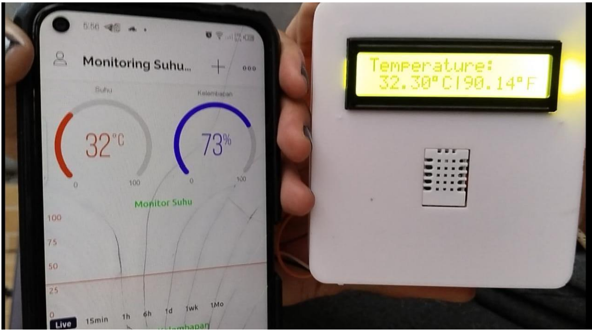
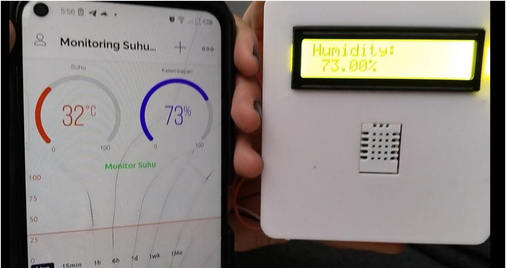
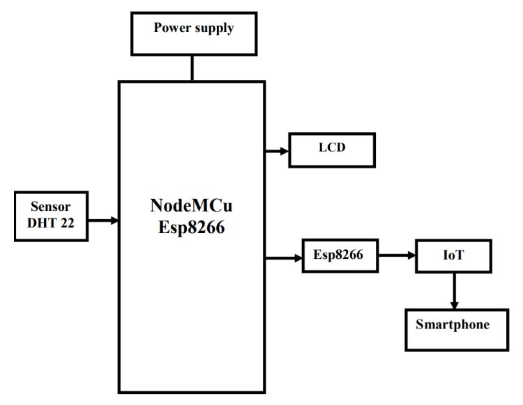
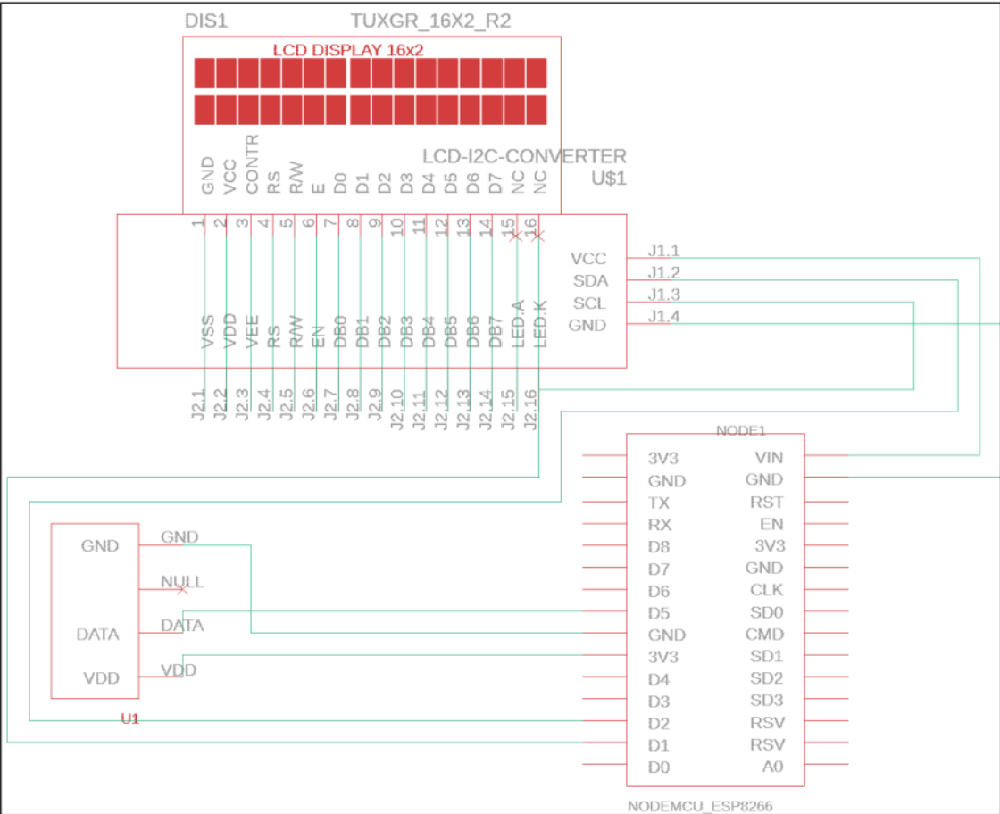
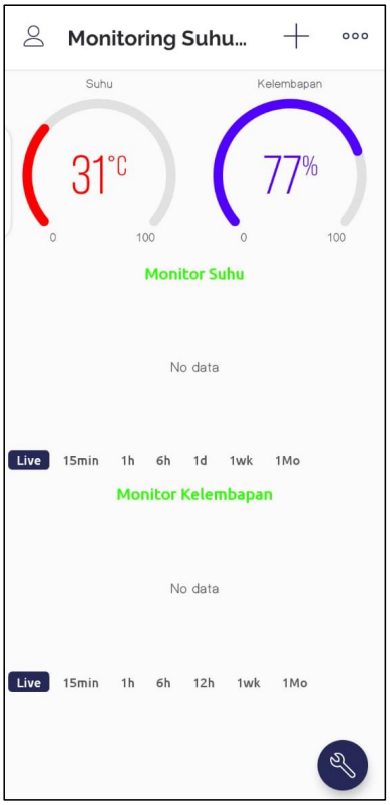

# MONITORING AIR TEMPERATURE AND HUMIDITY USING IOT-BASED DHT22 SENSOR
# Monitoring Suhu dan Kelembapan 🌡️💧

Selamat datang di proyek **Monitoring Suhu dan Kelembapan**! Proyek ini dirancang untuk memonitor suhu dan kelembapan dalam ruangan dan mengirimkan data ke platform Blynk. Dengan menggunakan berbagai perangkat, Anda dapat memantau kondisi suhu dan kelembapan secara real-time.

## Alat dan Bahan
### Alat:
- Sensor DHT22
- NodeMcu ESP8266 CH340G
- LCD I2C 1602
- Kabel Jumper (Male to Male)
- Adaptor Charger HP (Output 5V)
- Kabel Data Micro USB 2.0
- Smartphone

### Bahan:
- Arduino IDE
- Blynk

## Diagram Blok
Berikut adalah diagram blok sederhana untuk proyek ini:

## Cara Penggunaan
1. Hubungkan sensor suhu dan kelembapan DHT ke pin yang sesuai di perangkat ESP8266.
2. Atur konfigurasi WiFi dan autentikasi Blynk pada kode Anda.
3. Unggah kode ini ke perangkat ESP8266 Anda.
4. Pantau suhu dan kelembapan melalui aplikasi Blynk di perangkat seluler Anda.

## Skematik Sistem Monitoring Suhu dan Kelembapan
Berikut adalah skematik sederhana untuk sistem monitoring suhu dan kelembapan:

Pastikan untuk mengikuti skematik di atas saat menghubungkan perangkat Anda. Ini akan membantu Anda memahami dengan jelas penempatan kabel dan bagaimana komponen-komponen terhubung satu sama lain.

## Mendesain Tampilan Anda Sendiri di Blynk
Anda dapat dengan mudah mendesain tampilan khusus Anda sendiri di Blynk untuk memantau suhu dan kelembapan. Tambahkan widget yang diperlukan dan hubungkan mereka ke port virtual yang sesuai di kode Anda.

## Kontribusi
Kami sangat menghargai kontribusi dari komunitas. Jika Anda menemukan masalah atau memiliki perbaikan yang ingin Anda tambahkan, silakan buat "Issue" atau "Pull Request" di repositori ini.

## Lisensi
Proyek ini dilisensikan di bawah Lisensi MIT - lihat [LICENSE](LICENSE) untuk informasi lebih lanjut.

🌟 Selamat memantau suhu dan kelembapan Anda! 🌟

